# CFPB Complaint Classification

I built this project to classify CFPB financial complaints into 5 categories, comparing a recurrent model ladder (LSTM variants) against a fine-tuned transformer (DistilBERT).

---

## Problem

Consumers submit unstructured complaint narratives to the Consumer Financial Protection Bureau (CFPB). The task is to classify each narrative into one of five primary financial product categories:
1. **Checking or savings account**
2. **Credit card**
3. **Debt collection**
4. **Money transfer, virtual currency, or money service**
5. **Student loan**

My goal wasn't to chase a benchmark score. I wanted to isolate the actual contribution of each architectural, representation, and optimization change across a disciplined ladder.

---

## Dataset

- **Source:** CFPB Consumer Complaint Database (`data/combined_complaints.parquet`).
- **Raw Extract:** 107,992 complaints across the 5 target categories.
- **Deduplication:** Exact duplicate narratives (6,190 boilerplate submissions across 848 distinct texts) are removed prior to splitting, leaving **101,802** unique complaints.
- **Class Balance:** Approximately 1.15:1 ratio post-deduplication (Checking/savings: 21,524; Money transfer: 20,940; Credit card: 20,684; Student loan: 19,985; Debt collection: 18,669).
- **Split:** Stratified 80% train (81,441), 10% validation (10,180), 10% test (10,181), frozen on disk in `data/splits/`.
- **Integrity:** Verified with cryptographic and content SHA-256 hashes (`data/dataset_manifest.json` and `data/splits/split_manifest.json`).

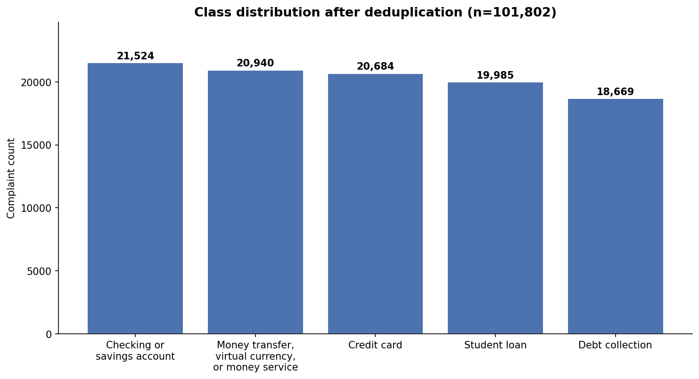

---

## Exploratory Data Analysis

Before touching any model, I audited the raw data for problems that could quietly wreck the results later.

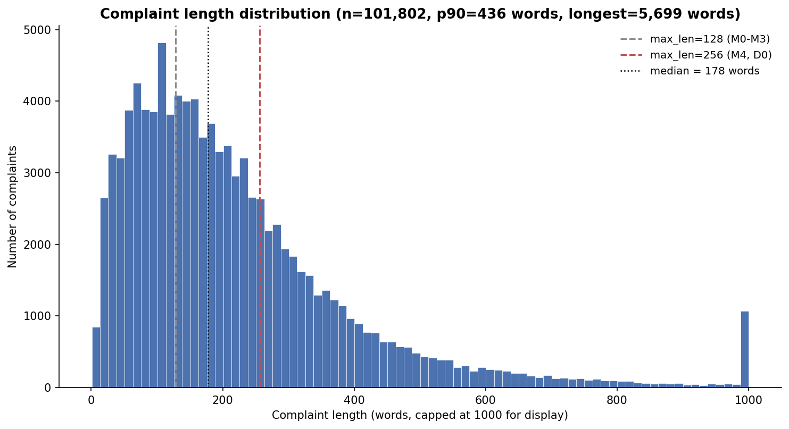

1. Median complaint length is 178 words, but the distribution has a long tail out to 5,699 words. Cutting text at 128 words was a real limitation since the model only reads about half the text on average. That's the direct reason M4 tests a longer 256-word limit.
2. DistilBERT's WordPiece tokenizer breaks words into more, smaller pieces than the Keras tokenizer, so it truncates a larger share of complaints at the same word-length limit.

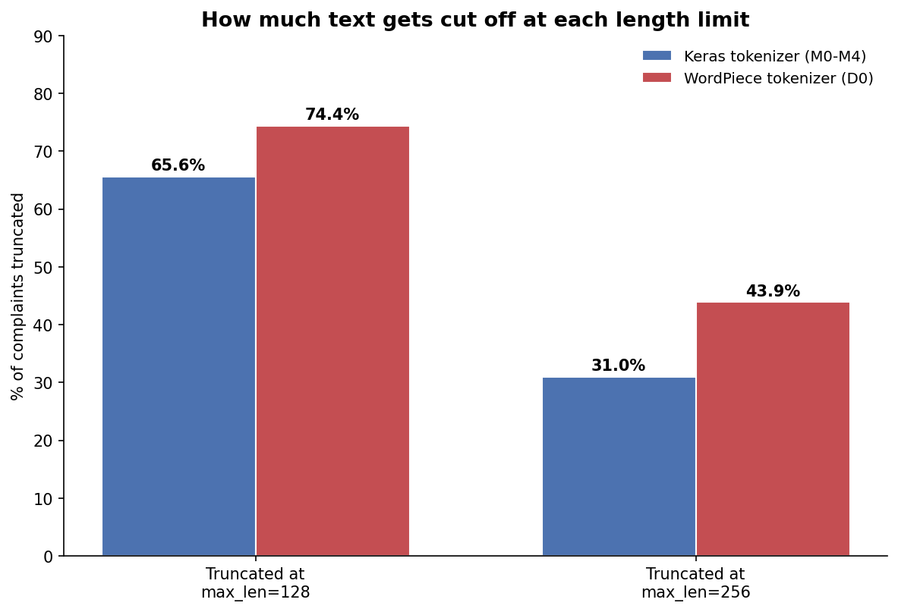

The near-duplicate check was the most important thing this audit caught. Exact duplicate removal alone isn't enough, since 7.8% of complaints still have a near-identical twin (same template, different name or amount) that a byte-for-byte check would miss entirely:

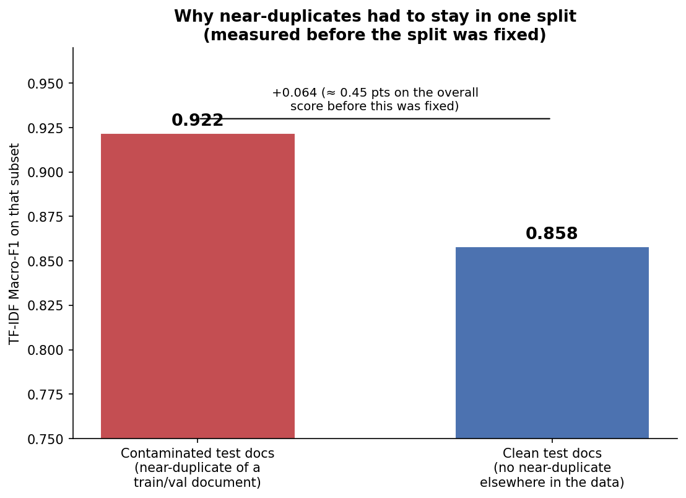

I measured this directly with a TF-IDF probe before fixing the split: 0.922 Macro-F1 on test documents that had a near-duplicate twin in train or validation, versus 0.858 on everything else, a gap large enough to meaningfully inflate the reported score. That's why the frozen split keeps near-duplicate clusters (TF-IDF cosine similarity ≥ 0.7) entirely inside one split instead of letting copies leak across train, validation, and test.

---

## Experimental Design

- **Single Controlled Variable:** Each step in the ladder introduces one isolated change (representation, directionality, regularization, or optimization).
- **Fixed Split:** All models train and evaluate on the exact same frozen splits.
- **Checkpoint Policy:** `ModelCheckpoint(save_best_only=True, monitor='val_macro_f1')` restores best validation weights on every run.
- **Stability References:** Multi-seed evaluation (seeds 42, 123, 456) for M0 baseline and D0 transformer.

---

## Model Ladder

| Model | Architecture | Key Change | Hypothesis |
|---|---|---|---|
| **M0** | Unidirectional LSTM | Random embeddings, `max_len=128`, hidden dim 128 | Baseline stability reference across 3 seeds |
| **M1** | Bidirectional LSTM | Bidirectional recurrent layer | Captures backward context (modest gain expected) |
| **M2** | BiLSTM + Spatial Dropout | Spatial Dropout (0.2) + Dropout (0.3) | Regularization to reduce train/val gap |
| **M3** | BiLSTM + Pretrained GloVe | GloVe-100d pretrained vectors | Accelerates convergence via pretrained semantics |
| **M4** | BiLSTM + GloVe + Optimized | LR schedule + EarlyStopping + `max_len=256` | Efficiency and extended sequence length |
| **D0** | DistilBERT | Fine-tuned `distilbert-base-uncased` | Pretrained contextual transformer benchmark |

---

## Evaluation

- **Primary Metric:** Macro-Averaged F1 (`macro_f1`).
- **Secondary Metrics:** Accuracy, Macro-Precision, Macro-Recall, Per-class F1, Confusion Matrix.
- **Delta Metrics:**
  - $\Delta\text{ vs Previous} = \text{Macro-F1}_{\text{current}} - \text{Macro-F1}_{\text{previous}}$
  - $\Delta\text{ vs M0} = \text{Macro-F1}_{\text{current}} - \text{Macro-F1}_{\text{M0}}$

---

## Results

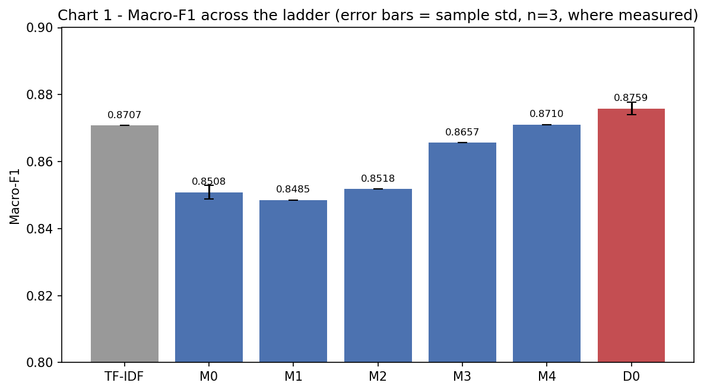

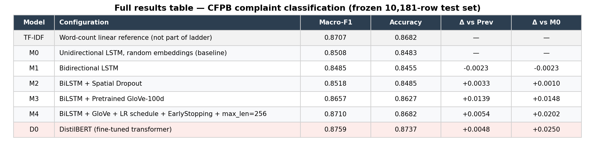

*Results are recorded to `results/runs.csv` during execution; full derivation of the deltas and variance reasoning below lives in `notebooks/05_final_results.ipynb`.*

| Model | Configuration | Macro-F1 | Accuracy | Δ vs Previous | Δ vs M0 | Interpretation |
|---|---|---|---|---|---|---|
| **M0** | Unidirectional LSTM baseline, random embeddings | 0.8508 ± 0.0021 (3 seeds) | 0.8483 | — | — | Baseline stability reference |
| **M1** | Bidirectional LSTM | 0.8485 | 0.8455 | −0.0023 | −0.0023 | Within M0's own seed spread, bidirectionality's effect can't be distinguished from run-to-run noise here |
| **M2** | BiLSTM + Spatial Dropout | 0.8518 | 0.8485 | +0.0033 | +0.0010 | Aggregate delta still within M0's spread, but training curves show clearly reduced train/val overfitting vs M1 |
| **M3** | BiLSTM + Pretrained GloVe-100d | 0.8657 | 0.8627 | +0.0139 | +0.0148 | Clearly outside M0's observed spread, the first unambiguous improvement in the ladder |
| **M4** | BiLSTM + GloVe + LR schedule + EarlyStopping + max_len=256 | 0.8710 | 0.8682 | +0.0054 | +0.0202 | Outside M0's spread, though only modestly (~1.3x), best recurrent model |
| **D0** | DistilBERT (fine-tuned transformer) | 0.8759 ± 0.0018 (3 seeds) | 0.8737 | +0.0048 | +0.0250 | All three seeds exceeded M4's single observed score, best model overall |

**Reading the table:**
1. M1 and M2 don't clearly beat the baseline on the aggregate number alone. M0's own 3-seed spread is wide enough to swallow both deltas.
2. M3 (GloVe) is the first change that moves the needle unambiguously.
3. M4 stacks LR scheduling, early stopping, and a longer context window on top of GloVe for the best recurrent result.
4. D0 beats M4 consistently across all three seeds it was run at. M4 itself was only run once, so that comparison isn't symmetric, see the notebook for the full caveat.

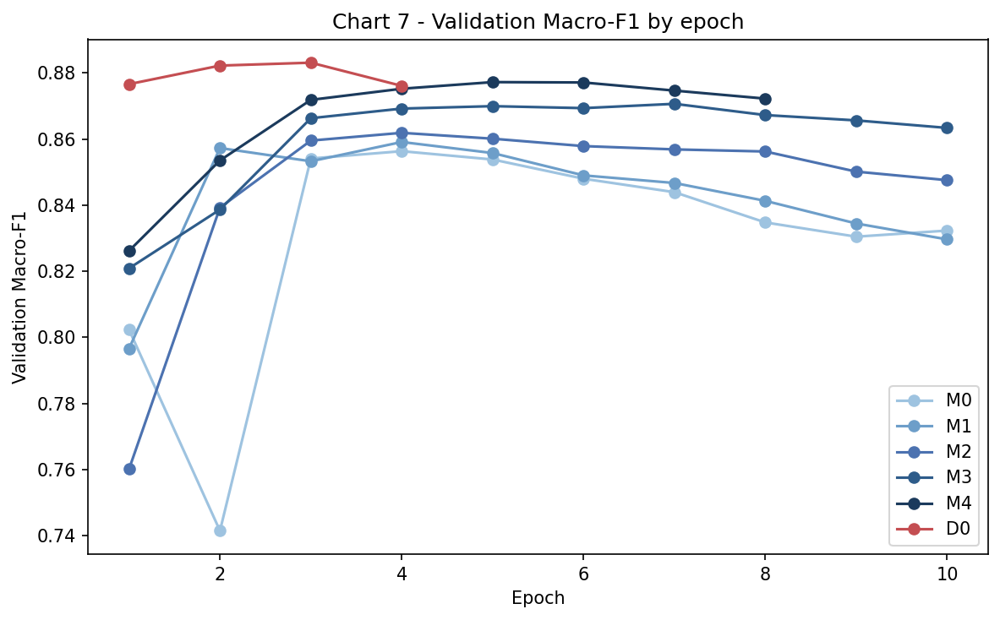

D0 hits its best validation score by epoch 4 and M4 by epoch 5, but M4 keeps training for 3 more epochs before early stopping kicks in, well after the LR schedule's one drop at epoch 7. That confirms what I found in the notebook: early stopping is what actually protects M4 from overfitting further, not the learning rate schedule, which fires too late to get credit for it. M0's validation curve is also visibly noisier early on (the epoch-2 dip) than M4 or D0, which is consistent with it having the widest seed-to-seed spread of any model here.

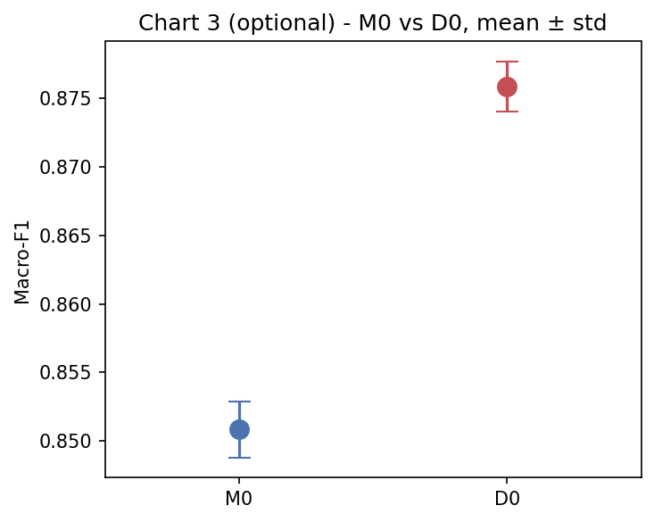

M0 and D0 are the only two models run across 3 seeds, and their spreads don't overlap: D0's worst seed (0.8740) still beats M0's best seed (0.8530) by a wide margin. That's what makes the D0 vs M0 gap a real, reproducible effect rather than a lucky draw, unlike M1 vs M0 where the whole delta sits inside a single model's own natural noise.

---

## Error Analysis

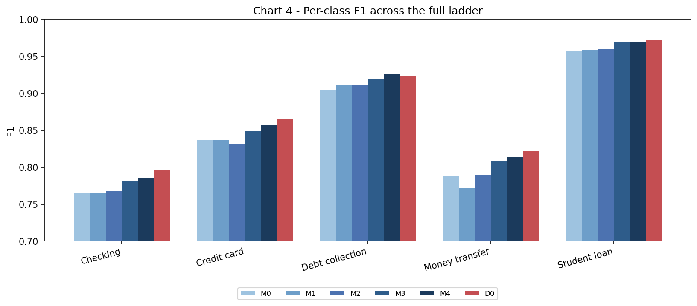

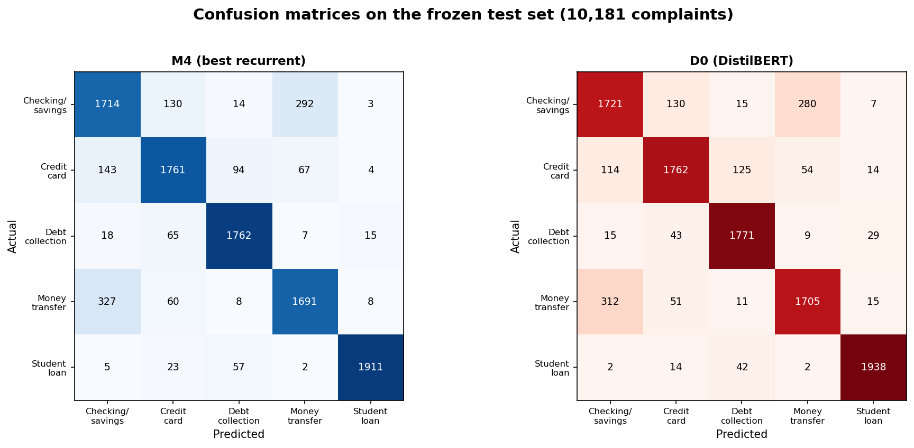

I compared M4 (best recurrent) against D0 (final transformer) on the same frozen 10,181-row test set, aligned by index (`results/error_analysis_examples.json`, full breakdown in `notebooks/05_final_results.ipynb`).

1. D0 improves per-class F1 in 3 of 5 classes (Checking/savings +0.0111, Credit card +0.0087, Money transfer +0.0085) and is marginally behind M4 on the other two (Debt collection −0.0023, Student loan −0.0015).
2. Neither model shows a large, one-sided failure mode. D0's overall edge is broad rather than concentrated in one category.
3. Both confusion matrices show the same dominant error: Checking/savings and Money transfer complaints get confused with each other far more than with any other class, likely reflecting real overlap in how consumers describe account and transfer disputes.
4. Credit Card vs Checking/Savings dispute narratives are the hardest class distinction for both models.
5. CFPB's `XXXX` redaction tokens and truncation on long complaints (>256 words) are areas I'd want to dig into further with more compute.

---

## Testing

I ran D0 against a handful of held-out complaints it never saw during training, pulled straight from the frozen test split, to sanity-check the predictions by hand instead of trusting the aggregate metric alone:

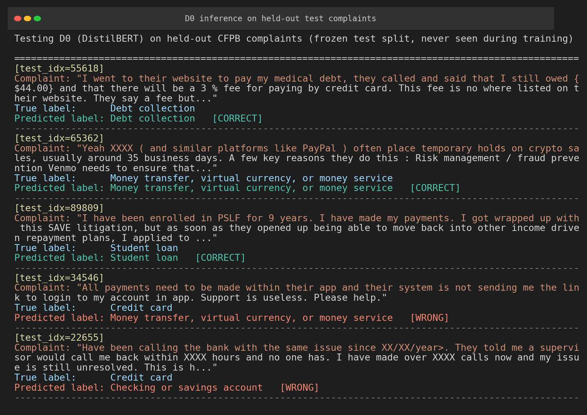

The two wrong predictions above show the actual failure mode: both are short complaints (one or two sentences) about app/login problems with no product-specific vocabulary, which is exactly the kind of case the confusion matrices above flag as ambiguous between Credit card, Checking/savings, and Money transfer.

The full automated suite (253 tests covering data loading, preprocessing, splitting, metrics, and checkpoint logic) passes before anything in this repo is treated as final:

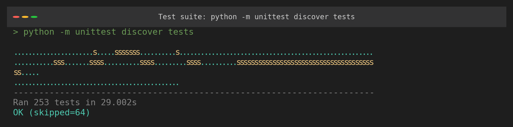

---

## Demo

I built a small Streamlit app (`app.py`) to try the model on complaints I type in myself, not just the frozen test set:

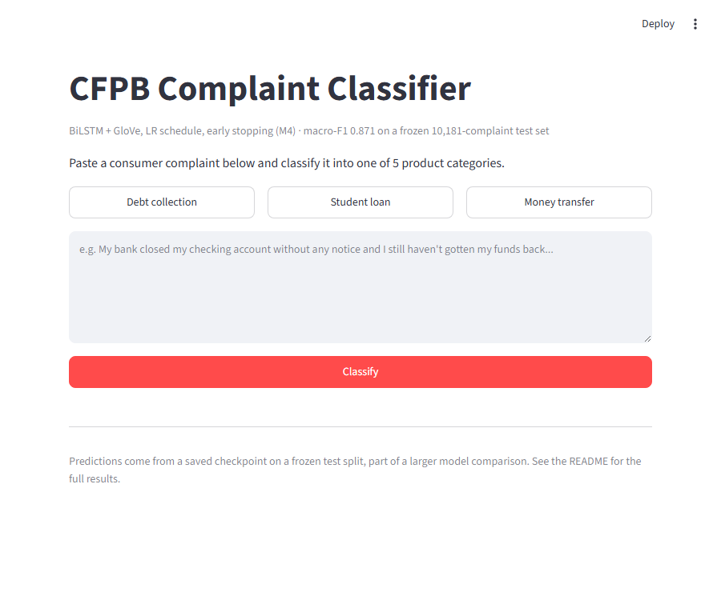

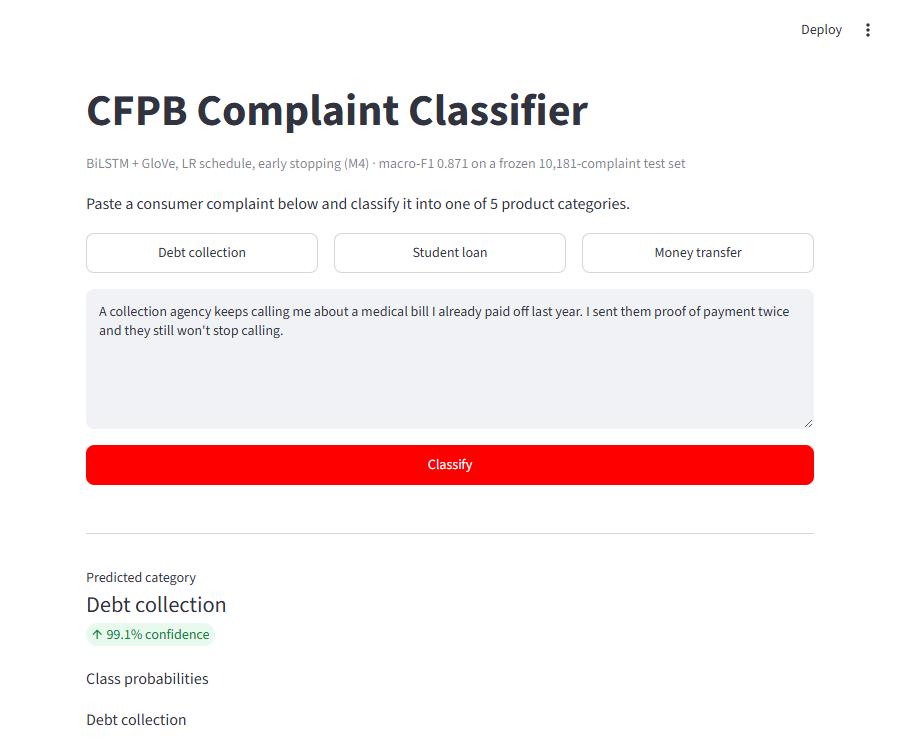

The demo runs M4, not D0. D0's saved checkpoint bakes in its AdamW optimizer state, and tf_keras's H5 loader can't reconcile that against a freshly built model in a separate process, a confirmed limitation I hit and documented in `scripts/run_d0.py`. M4's checkpoint has no such optimizer group and reloads cleanly, so it's what powers this demo.

```bash
streamlit run app.py
```

---

## Limitations

- **M4 Enhancement Bundling:** Learning rate scheduling, early stopping, and extending `max_len` from 128 to 256 are bundled in M4 due to compute budget. The standalone contribution of `max_len` is not isolated.
- **Redaction Reliance:** CFPB data contains synthetic redaction tokens (`XXXX`) whose distribution varies by product category.
- **Hardware Variation:** Training runtimes reflect CPU / single-GPU environments and are recorded in `results/runs.csv`.

---

## Reproduction

### Environment Setup
```bash
python -m venv .venv
# Activate virtual environment:
# Windows: .venv\Scripts\activate
# Linux/macOS: source .venv/bin/activate
pip install -r requirements.txt
```

### Verification & Split Freezing
```bash
python src/verify_all.py
```

### Running Unit Tests
```bash
python -m unittest discover tests
```

---

## Project Structure

```text
├── configs/
│   └── data_config.json          # Central dataset and tokenization parameters
├── data/
│   ├── combined_complaints.parquet # Master dataset (107,992 rows)
│   ├── dataset_manifest.json     # Cryptographic & content dataset fingerprint
│   ├── splits/                   # Frozen train/val/test split indices
│   └── embeddings/                # GloVe pretrained vectors
├── notebooks/
│   ├── 00_master_pipeline.ipynb  # All five notebooks below, combined and executed in order
│   ├── 01_eda.ipynb              # Dataset audit: duplicates, leakage, length, GloVe coverage
│   ├── 02_preprocessing.ipynb    # Text cleaning, tokenization, split building
│   ├── 03_evaluation.ipynb       # Evaluation library checks (metrics, deltas, seed stats)
│   ├── 04_tfidf_reference.ipynb  # TF-IDF + logistic regression reference model
│   └── 05_final_results.ipynb    # Full comparison table, charts, and error analysis
├── results/
│   ├── runs.csv                  # Immutable experiment execution record
│   ├── m0/ ... m4/, d0/          # Per-experiment, per-seed metrics and predictions
│   ├── tfidf_reference.json      # TF-IDF reference run
│   └── error_analysis_examples.json # Sampled M4 vs D0 disagreement examples
├── src/
│   ├── data.py                   # Data loading, deduplication, and labels
│   ├── preprocessing.py          # Text cleaning and normalization
│   ├── keras_tokenizer.py        # Tokenizer used by the recurrent models
│   ├── embeddings.py             # GloVe loading and coverage checks
│   ├── models.py                 # LSTM/BiLSTM model definitions
│   ├── distilbert.py             # DistilBERT fine-tuning
│   ├── fingerprint.py            # Dataset & split cryptographic fingerprinting
│   ├── split.py                  # Stratified, near-duplicate-aware splitting
│   ├── evaluation.py             # Macro-F1, metrics, and delta calculations
│   ├── checkpoint.py             # Deterministic checkpoints and metric gating
│   ├── config.py                 # Configuration loader and validator
│   ├── reproducibility.py        # Multi-framework seed control and environment capture
│   └── results.py                # runs.csv schema validation and table generator
├── scripts/
│   ├── build_splits.py           # Builds the frozen train/val/test split
│   ├── run_m0.py ... run_m4.py, run_d0.py # Training entry points for each experiment
│   └── project_check.py          # Pre-flight guard: structure, config, tests
└── tests/                        # Focused CPU unit test suite
```
