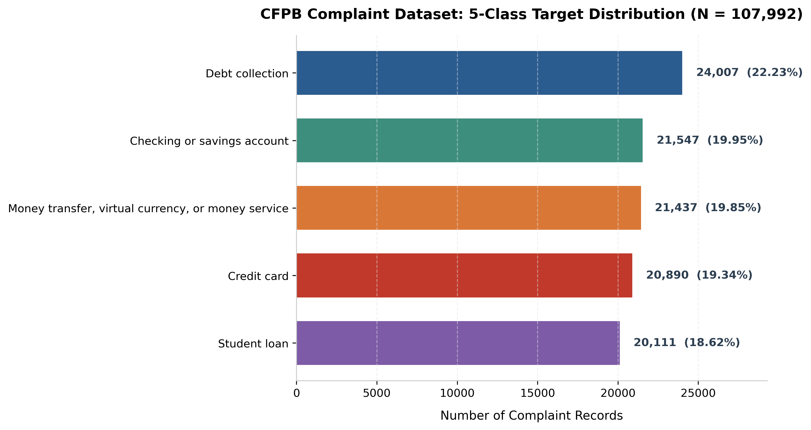
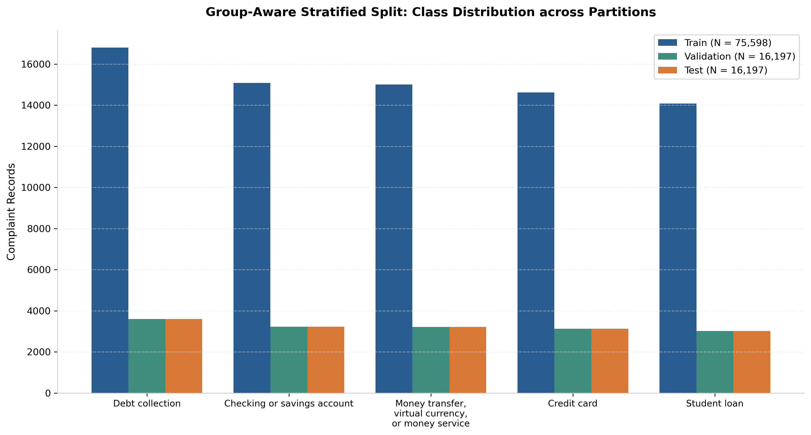
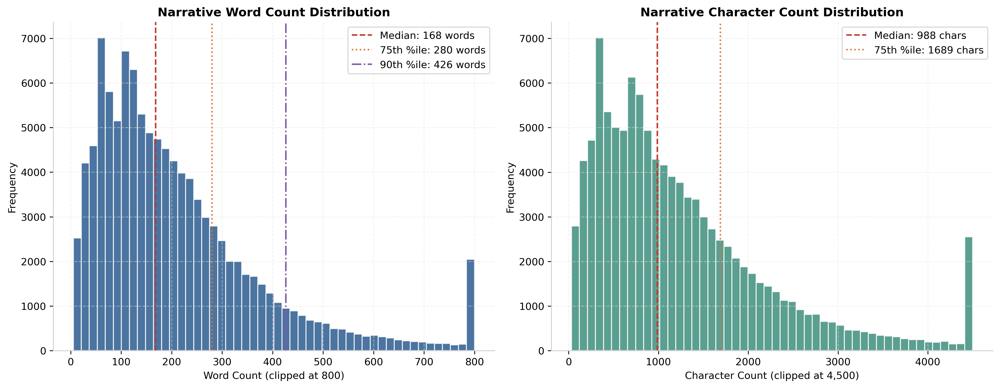
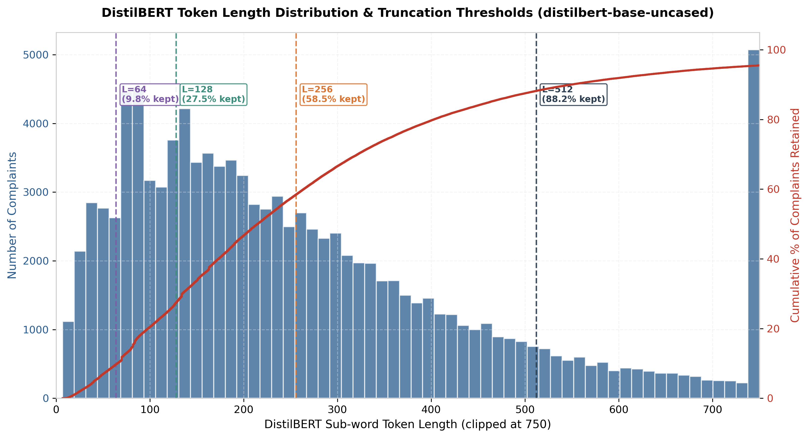
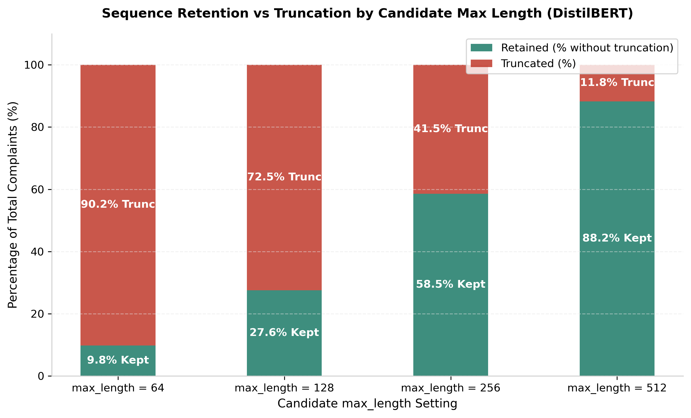

# Phase 4 — Modeling Dataset Construction Report

- **Project:** FinTech Complaint Classification: A Controlled LSTM-to-DistilBERT Enhancement Study
- **Dataset Version:** `cfpb_phase4_v1`
- **Date Completed:** 2026-08-18
- **Primary Source:** CFPB Consumer Complaint Database (Acquired in Phase 2B, Audited in Phase 3)
- **Status:** **COMPLETE** (Gate satisfied; ready for Phase 5 LSTM Baseline)

---

## Executive Summary

Phase 4 transformed the 107,992 verified raw CFPB complaint records into a clean, reproducible, leakage-safe modeling dataset without modifying or discarding raw source files.

Key outcomes:
1. **Zero Data Loss:** All 107,992 raw complaints were audited, validated, and allocated into the modeling dataset (0 dropped rows).
2. **Locked Target Strategy Preserved:** The five native CFPB `Product` labels (Option A) are preserved verbatim.
3. **Exact Duplicate Group Isolation:** All 7,035 duplicate complaints across 847 narrative groups (including boilerplate templates up to 832 identical rows) were assigned deterministic group IDs and confined strictly to single partitions.
4. **Zero Cross-Split Contamination:** Verified **0 Complaint ID overlap** and **0 narrative-group overlap** across train, validation, and test splits.
5. **Group-Aware Stratified Splitting:** 70.00% train (75,598 rows), 15.00% validation (16,197 rows), and 15.00% test (16,197 rows) with near-perfect per-class stratification (seed = 42).
6. **Empirical Sequence Length Analysis:** Tokenized all 107,992 complaints with `distilbert-base-uncased` to measure actual sub-word token lengths (median 215 tokens, 75th percentile 358 tokens) and quantify truncation rates across candidate sequence lengths.
7. **Strict Featurization Hygiene:** LSTM vocabulary (25,000 tokens) and balanced class weights were calculated **strictly on the training split**.
8. **GloVe Embedding Preparation:** Evaluated GloVe 6B 100d coverage on the training vocabulary (81.11% word coverage, 99.11% token frequency coverage).

---

## A. Dataset Summary

The acquired dataset consists of 107,992 verified consumer complaints across the five locked product categories.

| Class ID | Target Label (`product`) | Record Count | Class Percentage (%) |
|:---:|---|---:|---:|
| **0** | Debt collection | 24,007 | 22.23% |
| **1** | Checking or savings account | 21,547 | 19.95% |
| **2** | Credit card | 20,890 | 19.34% |
| **3** | Money transfer, virtual currency, or money service | 21,437 | 19.85% |
| **4** | Student loan | 20,111 | 18.62% |
| **Total** | **All 5 Classes** | **107,992** | **100.00%** |

- **Class Imbalance Ratio:** 1.194x between the largest class (`Debt collection`: 24,007) and smallest class (`Student loan`: 20,111).
- **Missing / Blank Values:** 0 missing complaint IDs, 0 missing or blank narrative texts, 0 unexpected labels.
- **Raw File Integrity:** All 5 source CSV files in `data/raw/cfpb/source/` remain unmodified.

---

## B. Split Summary

A group-aware stratified partition was constructed using random seed `42` with target ratios of 70% / 15% / 15%.

| Partition | Total Records | Share (%) | Narrative Groups | Distinct Products |
|---|---:|---:|---:|:---:|
| **Train** | 75,598 | 70.00% | 71,247 | 5 |
| **Validation** | 16,197 | 15.00% | 15,279 | 5 |
| **Test** | 16,197 | 15.00% | 15,278 | 5 |
| **Total** | **107,992** | **100.00%** | **101,804** | **5** |

### Per-Class Distribution across Partitions

The group-aware stratification maintained target proportions across all 5 classes with high fidelity:

| Product Class | Total Rows | Train Count (%) | Validation Count (%) | Test Count (%) |
|---|---:|---:|---:|---:|
| **Debt collection** | 24,007 | 16,805 (70.00%) | 3,601 (15.00%) | 3,601 (15.00%) |
| **Checking or savings account** | 21,547 | 15,083 (70.00%) | 3,232 (15.00%) | 3,232 (15.00%) |
| **Credit card** | 20,890 | 14,624 (70.00%) | 3,133 (15.00%) | 3,133 (15.00%) |
| **Money transfer, virtual currency, or money service** | 21,437 | 15,007 (70.01%) | 3,215 (15.00%) | 3,215 (15.00%) |
| **Student loan** | 20,111 | 14,079 (70.01%) | 3,016 (15.00%) | 3,016 (15.00%) |

---

## C. Leakage Analysis & Duplicate Isolation

### 1. Exact Duplicate Narrative Groups
- **Unique Narrative Texts:** 101,804 unique texts across 107,992 complaints.
- **Duplicate Narrative Rows:** 7,035 complaints (6.51% of corpus) share exact narrative text with at least one other complaint.
- **Duplicate Groups Count:** 847 distinct groups (size $\ge 2$).
- **Largest Duplicate Group:** 832 identical records (credit dispute boilerplate).

### 2. Conflicting Duplicate-Label Groups
Phase 3 identified duplicate texts mapping to multiple `product` labels. Phase 4 audited these groups and confirmed that **7 groups** (totaling **49 records**) exhibit label conflicts.

| Group ID | Total Rows | Partition | Label Breakdown | Sample Text Snippet |
|---|---:|:---:|---|---|
| `055354282e8ec516` | 5 | **Test** | `Debt collection`: 4, `Credit card`: 1 | *"I reviewed my consumer credit reports and identified multiple accounts and tradelines that are inacc..."* |
| `5417240ab32deeab` | 6 | **Validation** | `Credit card`: 4, `Checking or savings`: 1, `Debt collection`: 1 | *"I am writing to have the following information removed from my credit file, the items that I need de..."* |
| `88093ba977b240b6` | 2 | **Train** | `Debt collection`: 1, `Student loan`: 1 | *"UNDER THE DOCTRINE OF ESTOPPEL BY SILENCE, XXXX XXXX XXXX ( MO ) XXXX XXXX XXXX, XXXX, I MAY PRESUME..."* |
| `98e4503d412df911` | 28 | **Validation** | `Debt collection`: 26, `Credit card`: 1, `Student loan`: 1 | *"This debt collector has done unjustifiable practices of the FDCPA which it prohibits. They furnished..."* |
| `af0142c26d5ff56f` | 4 | **Test** | `Credit card`: 3, `Debt collection`: 1 | *"I am disputing the accuracy of an account being reported on my credit report. I have not received do..."* |
| `b794fe416a005ce1` | 2 | **Validation** | `Debt collection`: 1, `Student loan`: 1 | *"I am writing to formally dispute my federal student loans and request a full discharge due to a seri..."* |
| `d5245eb9cc7a86de` | 2 | **Test** | `Credit card`: 1, `Student loan`: 1 | *"I checked my credit report and noticed some inaccurate information. Please see the attached document..."* |

### 3. Leakage Verification Results
- **Complaint ID Overlap:**
  - $\text{Train} \cap \text{Validation} = 0$
  - $\text{Train} \cap \text{Test} = 0$
  - $\text{Validation} \cap \text{Test} = 0$
- **Narrative Group ID Overlap:**
  - $\text{Train} \cap \text{Validation} = 0$
  - $\text{Train} \cap \text{Test} = 0$
  - $\text{Validation} \cap \text{Test} = 0$
- **Conflicting Group Integrity:** Every conflicting group is 100% contained within a single partition (1 group in Train, 3 in Validation, 3 in Test).

---

## D. Text and Sequence Length Analysis

Sequence length was evaluated across all 107,992 records using three metrics:
1. **Character Length**
2. **Whitespace Word Count**
3. **Actual DistilBERT Token Count** (`distilbert-base-uncased`)

| Metric | Min | 25th %ile | Median (50th) | Mean | 75th %ile | 90th %ile | 95th %ile | 99th %ile | Max |
|---|---:|---:|---:|---:|---:|---:|---:|---:|---:|
| **Character Length** | 32 | 529 | 988 | 1,307.1 | 1,689 | 2,588 | 3,385 | 5,929 | 31,995 |
| **Word Count** | 5 | 94 | 168 | 218.8 | 280 | 426 | 557 | 986 | 5,699 |
| **DistilBERT Tokens** | 7 | 120 | 215 | 281.8 | 358 | 550 | 720 | 1,289 | 9,071 |

---

## E. DistilBERT Truncation Analysis & Max Length Decision

Sub-word tokenization produces approximately **1.28x** more tokens than whitespace words. Evaluating candidate `max_length` settings against actual tokenizer outputs yields:

| Candidate `max_length` | Truncated Count | % Truncated | % Retained Intact | CPU Compute / Memory Trade-off |
|:---:|---:|---:|---:|---|
| **64** | 97,389 | 90.18% | 9.82% | Extremely fast, but discards crucial narrative details in >90% of complaints. |
| **128** | 78,245 | 72.45% | 27.55% | **Recommended initial baseline.** Captures initial grievance context; fast CPU execution. |
| **256** | 44,775 | 41.46% | 58.54% | High coverage (~58.5% full text); 4x attention cost of L=128 ($O(L^2)$). |
| **512** | 12,738 | 11.80% | 88.20% | Captures 88.2% of complaints; prohibitive CPU fine-tuning time for full corpus. |

### Recommendation & Rationale:
- **Baseline Recommendation:** `max_length = 128` for initial recurrent baseline (E0/E1) and initial DistilBERT fine-tuning exploration on CPU.
- **Compute Strategy (Section 25):** DistilBERT fine-tuning will utilize a stratified ~8,000–10,000 subset on CPU, where `max_length = 128` provides an optimal balance between execution speed and semantic representation.

---

## F. LSTM Tokenizer & Vocabulary Preparation

The recurrent vocabulary was constructed **strictly from the 75,598 training narratives**:
- **Tokenizer Strategy:** Lowercased regex word tokenizer (`[a-z0-9]+(?:'[a-z]+)?`) preserving financial numbers, contractions, and domain words.
- **Special Tokens:** `<pad>` (index 0), `<unk>` (index 1).
- **Total Unique Words in Train Corpus:** 47,005
- **Fitted Vocabulary Size:** 25,000 words (filtered by $\text{min\_freq} \ge 2$, top 25k).
- **Coverage & OOV Rate:**

| Split Partition | Total Tokens | OOV Tokens | Token Coverage (%) | OOV Rate (%) |
|---|---:|---:|---:|---:|
| **Train (75,598 rows)** | 16,543,620 | 34,705 | 99.79% | 0.21% |
| **Validation (16,197 rows)** | 3,546,678 | 20,832 | 99.41% | 0.59% |
| **Test (16,197 rows)** | 3,541,757 | 21,570 | 99.39% | 0.61% |

---

## G. GloVe Embedding Compatibility Preparation (E3 Preparation)

- **Selected GloVe Vector:** `glove.6B.100d` (100-dimensional embeddings from Stanford GloVe 6B).
- **Storage Location:** `data/embeddings/glove.6B.100d.txt` (stored on `D:` drive; 862MB archive cleaned up).
- **Vocabulary Coverage Evaluation (Strictly against Training Vocab):**
  - **GloVe Total Vocabulary:** 400,000 words
  - **Training Vocab Words Evaluated:** 24,998 (excluding `<pad>` and `<unk>`)
  - **Matched Words:** 20,277 (81.11% unique word coverage)
  - **Missing Words:** 4,721 (18.89% unique word OOV)
  - **Token Frequency Coverage:** **99.11%** (99.11% of all word instances across the training corpus are present in GloVe).
- **Top Missing Domain Terms:**
  1. `mohela` (14,634 occurrences) — Major student loan servicer
  2. `fdcpa` (7,829 occurrences) — Fair Debt Collection Practices Act acronym
  3. `navient` (6,303 occurrences) — Student loan servicer
  4. `cfpb` (6,155 occurrences) — Regulatory agency acronym
  5. `chexsystems` (3,409 occurrences) — Banking verification reporting agency
  6. `experian` / `transunion` (3,284 / 3,165 occurrences) — Credit bureaus
  7. `zelle` (2,752 occurrences) — Peer-to-peer payment platform
  8. `coinme` / `kraken` (1,223 / 742 occurrences) — Crypto platforms

---

## H. Class-Weight Preparation (E6 Preparation)

Class weights were calculated **strictly on the 75,598 training records** using the balanced inverse-frequency formula:
$$w_c = \frac{N_{\text{train}}}{N_{\text{classes}} \times N_{\text{train}, c}}$$

| Class ID | Target Label (`product`) | Training Count | Calculated Weight ($w_c$) |
|:---:|---|---:|---:|
| **0** | Debt collection | 16,805 | 0.899708 |
| **1** | Checking or savings account | 15,083 | 1.002427 |
| **2** | Credit card | 14,624 | 1.033889 |
| **3** | Money transfer, virtual currency, or money service | 15,007 | 1.007503 |
| **4** | Student loan | 14,079 | 1.073911 |

### Experimental Expectation Note:
Because Phase 2B targeted ~20,000 rows per provisional product, the acquired training dataset has an imbalance ratio of only **1.194x**. Consequently, all calculated weights lie between 0.90 and 1.07. As documented in Phase 3, **class weighting in experiment E6 is expected to have a minimal performance delta**. This is an expected empirical consequence of the acquisition design, not an error.

---

## I. Data Loss Accounting

| Reason | Count | % of Raw Data | Action Taken |
|---|---:|---:|---|
| Missing Narrative Text | 0 | 0.00% | None (0 records found) |
| Invalid / Unexpected Product Label | 0 | 0.00% | None (0 records found) |
| Corrupt / Unreadable Schema | 0 | 0.00% | None (0 records found) |
| Duplicate Record Exclusions | 0 | 0.00% | None (duplicates isolated via group ID) |
| **Total Excluded Records** | **0** | **0.00%** | **100% of Raw Data Retained** |

---

## J. Final Phase 4 Decisions & Artifact Inventory

| Property | Phase 4 Locked Decision |
|---|---|
| **Dataset Version** | `cfpb_phase4_v1` |
| **Random Seed** | `42` |
| **Target Labels** | Option A — 5 native CFPB Product labels verbatim |
| **Splitting Method** | Group-Aware Stratified Split (`narrative_group_id`) |
| **Partition Sizes** | Train: 75,598 (70%), Val: 16,197 (15%), Test: 16,197 (15%) |
| **LSTM Max Length** | 128 tokens |
| **DistilBERT Max Length** | 128 tokens (recommended initial baseline) |
| **LSTM Vocab Size** | 25,000 tokens (train-only) |
| **GloVe Vector** | GloVe 6B 100d (99.11% token frequency coverage) |

### Generated Artifacts
- Processed Data:
  - `data/processed/train.parquet` & `data/processed/train.csv`
  - `data/processed/validation.parquet` & `data/processed/validation.csv`
  - `data/processed/test.parquet` & `data/processed/test.csv`
- Metadata:
  - `data/processed/label_mapping.json`
  - `data/processed/split_metadata.json`
  - `data/processed/class_weights.json`
  - `data/processed/sequence_length_analysis.json`
  - `data/processed/lstm_vocab.json`
  - `data/processed/glove_coverage.json`
- Analysis Notebook:
  - `notebooks/01_cfpb_data_analysis.ipynb` (fully executed with rendered figures)
- Visualizations:
  - `reports/figures/phase4/class_distribution.png`
  - `reports/figures/phase4/split_class_distribution.png`
  - `reports/figures/phase4/narrative_length_distribution.png`
  - `reports/figures/phase4/distilbert_token_length_distribution.png`
  - `reports/figures/phase4/truncation_rate_comparison.png`
- Tests:
  - `tests/test_phase4.py` (10/10 invariant assertions passing)

---
*Phase 4 is complete. In accordance with the stop condition, no models have been built or trained.*
