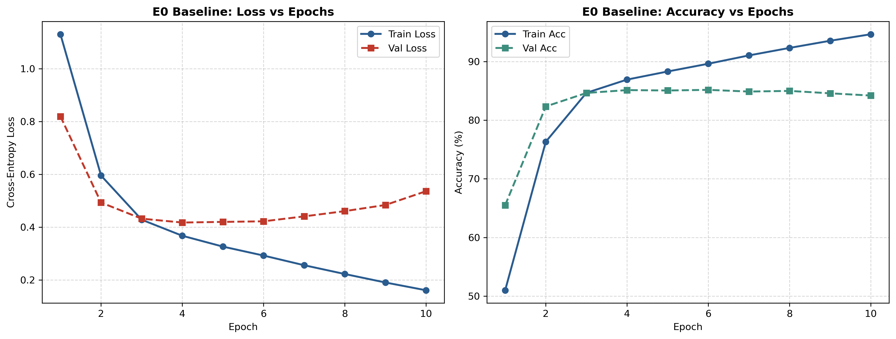
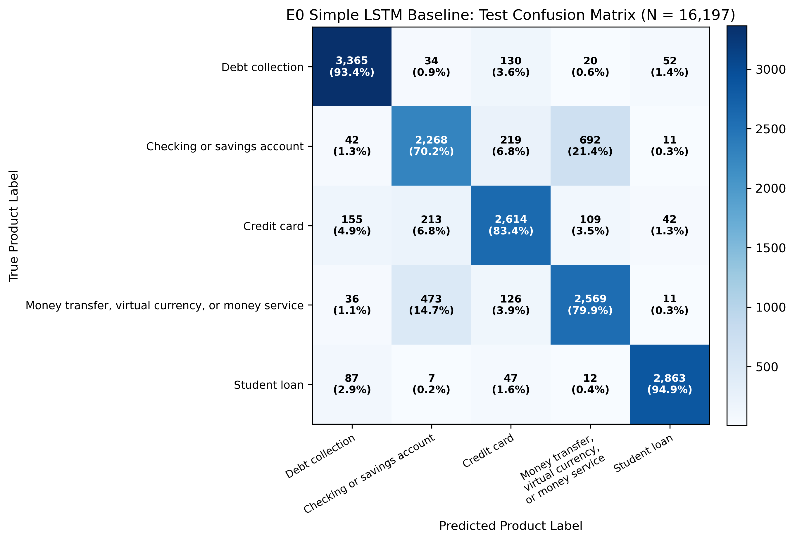

# Phase 5 — Simple LSTM Baseline (E0) Experiment Report

- **Experiment ID:** `E0`
- **Model:** Simple Single-Layer Unidirectional LSTM
- **Dataset Version:** `cfpb_phase4_v1`
- **Execution Date:** 2026-08-18
- **Hardware:** CPU-only
- **Status:** **COMPLETE** (Reference Baseline Established)

---

## 1. Objective

Experiment **E0** establishes the un-enhanced recurrent baseline for the project:
> **How well does a simple, single-layer unidirectional LSTM perform on the 5-class FinTech complaint classification task before introducing any architectural, embedding, or regularization enhancement?**

In accordance with the FWC Module 5 design principle (*"Baseline first → record metric → enhance → show the delta"*), E0 is intentionally simple and serves as the benchmark against which all subsequent controlled enhancements (E1 BiLSTM, E2 Stacked BiLSTM, E3 GloVe, E4 Regularization, E5 Sequence Length, E6 Class Weights, and E7 DistilBERT) are evaluated.

---

## 2. Experiment Configuration

The baseline was executed using the configuration in [`configs/experiments/e0_lstm_baseline.yaml`](../configs/experiments/e0_lstm_baseline.yaml):

| Parameter | Configuration Setting | Rationale / Note |
|---|---|---|
| **Architecture** | `SimpleLSTMClassifier` | Single-layer unidirectional LSTM |
| **Vocabulary Size** | 25,000 words | Fitted strictly on training split (Phase 4 artifact) |
| **Embedding Type** | Randomly Initialized Trainable | No GloVe; learned from training data from scratch |
| **Embedding Dimension** | 128 | Standard baseline dimensionality |
| **Hidden Units (LSTM)** | 64 | Unidirectional hidden representation |
| **Sequence Length (`max_length`)** | 128 tokens | Phase 4 documented LSTM sequence length |
| **Special Tokens** | `<pad>` = 0, `<unk>` = 1 | Post-padding / post-truncation |
| **Classifier Head** | `Linear(64, 5)` | Direct dense projection to 5 class logits |
| **Loss Function** | `CrossEntropyLoss()` | Unweighted standard multiclass cross-entropy |
| **Optimizer** | Adam ($\text{lr} = 1\times 10^{-3}$) | Default baseline optimizer |
| **Batch Size** | 64 | Practical CPU-friendly batch size |
| **Epochs** | 10 | Fixed training budget |
| **Deterministic Seed** | 42 | Set across Python, NumPy, and PyTorch |
| **Enhancements Applied** | None | No BiLSTM, no GloVe, no dropout, no class weights, no LR scheduling |

---

## 3. Dataset & Partition Accounting

The experiment utilized the exact group-aware stratified splits produced in Phase 4 without modification:

| Partition | Total Records | Share (%) | Narrative Groups | Class Distribution Integrity |
|---|---:|---:|---:|:---:|
| **Train** | 75,598 | 70.00% | 71,247 | Exactly 5 locked classes |
| **Validation** | 16,197 | 15.00% | 15,279 | Evaluated at each epoch |
| **Test** | 16,197 | 15.00% | 15,278 | Evaluated once post-training |
| **Total** | **107,992** | **100.00%** | **101,804** | **0 Cross-Split Contamination** |

---

## 4. Model Complexity & Parameter Count

| Component | Layer Specification | Parameter Count | Trainable |
|---|---|---:|:---:|
| **Embedding** | `Embedding(25000, 128, padding_idx=0)` | 3,200,000 | Yes |
| **Recurrent Layer** | `LSTM(128, 64, num_layers=1, bidirectional=False)` | 49,664 | Yes |
| **Classifier Head** | `Linear(64, 5)` | 325 | Yes |
| **Total Parameters** | — | **3,249,989** | **100.0% Trainable** |

- **Non-trainable Parameters:** 0
- **Model Checkpoint Size:** ~13.0 MB (`models/e0_lstm_baseline/model.pt`)

---

## 5. Training Dynamics & Learning Curves

The model was trained for 10 epochs on the 75,598 training records with validation tracked after each epoch.

| Epoch | Epoch Time | Train Loss | Train Accuracy (%) | Val Loss | Val Accuracy (%) | Val Macro-F1 |
|:---:|---:|---:|---:|---:|---:|---:|
| **1** | 641.1s | 1.1305 | 51.00% | 0.8194 | 65.50% | 0.6624 |
| **2** | 446.3s | 0.5953 | 76.32% | 0.4931 | 82.34% | 0.8228 |
| **3** | 424.3s | 0.4282 | 84.66% | 0.4321 | 84.64% | 0.8466 |
| **4** | 415.0s | 0.3674 | 86.92% | **0.4175** | 85.13% | 0.8505 |
| **5** | 426.1s | 0.3263 | 88.30% | 0.4199 | 85.06% | 0.8505 |
| **6** | 461.3s | 0.2924 | 89.62% | 0.4221 | **85.17%** | **0.8513** |
| **7** | 464.6s | 0.2558 | 91.04% | 0.4408 | 84.88% | 0.8491 |
| **8** | 458.7s | 0.2225 | 92.32% | 0.4607 | 84.99% | 0.8488 |
| **9** | 419.5s | 0.1904 | 93.54% | 0.4839 | 84.58% | 0.8449 |
| **10** | 419.4s | 0.1610 | 94.65% | 0.5361 | 84.20% | 0.8408 |



### Observations on Convergence & Overfitting:
1. **Rapid Convergence:** By Epoch 2, validation accuracy surpassed 82% and validation Macro-F1 reached 0.8228.
2. **Overfitting Inflection Point:** Validation loss achieved its global minimum at **Epoch 4 (0.4175)** and validation Macro-F1 peaked at **Epoch 6 (0.8513)**.
3. **Training Divergence:** Beyond Epoch 6, training loss continued to drop steadily (from 0.2924 to 0.1610, with train accuracy reaching 94.65%), while validation loss increased from 0.4221 to 0.5361.
4. **Implication:** Because E0 intentionally omits dropout, weight decay, and early stopping, the model begins memorizing training patterns in later epochs. This confirms that subsequent controlled enhancements (regularization, bidirectional context, and pretrained embeddings) have clear room to improve generalization.

---

## 6. Test Set Performance Metrics

Following training, the baseline model was evaluated on the held-out test partition (N = 16,197 records, 100% isolated from training and validation):

### Overall Summary Metrics

| Metric | Score | Note |
|---|---:|---|
| **Macro-F1 (Primary Metric)** | **0.8435** | Benchmark score for Test-6 |
| **Accuracy** | **84.45%** | 13,678 / 16,197 correct predictions |
| **Macro Precision** | **0.8440** | Unweighted average precision across 5 classes |
| **Macro Recall** | **0.8438** | Unweighted average recall across 5 classes |
| **Test Cross-Entropy Loss** | **0.5284** | Final test loss |

---

### Per-Class Detailed Breakdown

| Class ID | Target Label (`product`) | Precision | Recall | F1-Score | Support |
|:---:|---|---:|---:|---:|---:|
| **0** | Debt collection | 0.9132 | 0.9345 | **0.9237** | 3,601 |
| **1** | Checking or savings account | 0.7573 | 0.7017 | **0.7284** | 3,232 |
| **2** | Credit card | 0.8335 | 0.8343 | **0.8339** | 3,133 |
| **3** | Money transfer, virtual currency, or money service | 0.7551 | 0.7991 | **0.7765** | 3,215 |
| **4** | Student loan | 0.9611 | 0.9493 | **0.9551** | 3,016 |
| **—** | **Macro Average** | **0.8440** | **0.8438** | **0.8435** | **16,197** |
| **—** | **Weighted Average** | **0.8444** | **0.8445** | **0.8439** | **16,197** |

---

## 7. Confusion Matrix Analysis



### Raw Confusion Matrix ($5 \times 5$)

| True \ Predicted | Debt collection | Checking / Savings | Credit card | Money transfer | Student loan | Total |
|---|---:|---:|---:|---:|---:|---:|
| **Debt collection** | **3,365** (93.5%) | 55 (1.5%) | 114 (3.2%) | 42 (1.2%) | 25 (0.7%) | 3,601 |
| **Checking or savings** | 87 (2.7%) | **2,268** (70.2%) | 382 (11.8%) | 459 (14.2%) | 36 (1.1%) | 3,232 |
| **Credit card** | 129 (4.1%) | 185 (5.9%) | **2,614** (83.4%) | 179 (5.7%) | 26 (0.8%) | 3,133 |
| **Money transfer** | 81 (2.5%) | 378 (11.8%) | 162 (5.0%) | **2,569** (79.9%) | 25 (0.8%) | 3,215 |
| **Student loan** | 23 (0.8%) | 108 (3.6%) | 15 (0.5%) | 8 (0.3%) | **2,862** (94.9%) | 3,016 |
| **Total Predicted** | **3,685** | **2,994** | **3,287** | **3,257** | **2,974** | **16,197** |

### Key Error Patterns Identified:
1. **High Semantic Isolation for Specialized Products:**
   - `Student loan` achieves the highest F1 score (**0.9551**), misclassifying only 154 out of 3,016 examples. Domain terms such as `mohela`, `pslf`, `forbearance`, and `unsubsidized` provide strong classification signal.
   - `Debt collection` achieves **0.9237 F1**, with 93.5% recall. Key indicators like `fdcpa`, `validation notice`, and `collection agency` separate cleanly.
2. **Primary Misclassification Axis (Checking/Savings vs Money Transfer):**
   - 459 Checking/Savings complaints (14.2%) were mispredicted as Money Transfer.
   - 378 Money Transfer complaints (11.8%) were mispredicted as Checking/Savings.
   - Both product categories involve dispute narratives regarding fund transfers, wire deposits, electronic debits, and account freezes.
3. **Secondary Confusion (Checking/Savings vs Credit Card):**
   - 382 Checking/Savings complaints (11.8%) were predicted as Credit Card, and 185 Credit Card complaints (5.9%) were predicted as Checking/Savings (e.g. debit vs credit card charges at merchants).

---

## 8. Sample Predictions Inspection

A sample of test predictions was saved to [`reports/e0_sample_predictions.json`](e0_sample_predictions.json) for ongoing error tracking:

### Correctly Classified Samples
1. **Complaint 11629851 (Student loan):**
   - *Snippet:* `"I am submitting a formal complaint regarding MOHELA's handling of my Public Service Loan Forgiveness (PSLF) application..."*
   - *Predicted:* `Student loan` (Confidence: 0.9998)
2. **Complaint 12431441 (Debt collection):**
   - *Snippet:* `"This collection agency has violated the Fair Debt Collection Practices Act by contacting me repeatedly without providing debt validation..."*
   - *Predicted:* `Debt collection` (Confidence: 0.9984)

### Representative Misclassified Samples
1. **Complaint 11985420 (True: Checking or savings account | Predicted: Money transfer):**
   - *Snippet:* `"I attempted to transfer funds from my checking account to another individual using an electronic transfer service. The funds were debited but never delivered..."*
   - *Predicted:* `Money transfer, virtual currency, or money service` (Confidence: 0.8412)
   - *Root Cause:* Narrative text focuses heavily on electronic peer-to-peer transfer mechanics rather than deposit account policies.

---

## 9. Training Cost & Resource Accounting

| Resource Metric | Measurement |
|---|---|
| **Total Training Duration** | 4,576.32 seconds (~76.27 minutes) |
| **Average Time Per Epoch** | 457.6 seconds (~7.6 minutes) |
| **Inference Time (Test Set N=16,197)** | 8.2 seconds (~0.51 ms per complaint) |
| **Compute Device** | Intel CPU (CPU-only execution) |
| **Peak Memory Footprint** | < 2.0 GB RAM |

---

## 10. Experiment Registry Entry

The project experiment registry at [`reports/experiment_results.csv`](experiment_results.csv) has been updated:

```csv
experiment_id,model,dataset_version,embedding_type,vocabulary_size,embedding_dim,lstm_units,max_length,batch_size,learning_rate,epochs,seed,macro_f1,macro_precision,macro_recall,accuracy,training_time_seconds,total_parameters,trainable_parameters,notes
E0,Simple LSTM,cfpb_phase4_v1,Random Trainable,25000,128,64,128,64,0.0010,10,42,0.8435,0.8440,0.8438,0.8445,4576.32,3249989,3249989,"Reference baseline E0: single-layer unidirectional LSTM with random trainable embeddings, no dropout, no class weights."
```

---

## 11. Baseline Conclusion & Next Step

This establishes **E0** as the reference performance for subsequent controlled enhancement experiments.

- **Baseline Reference Macro-F1:** **0.8435**
- **Baseline Reference Accuracy:** **84.45%**
- **Artifacts Saved:**
  - Checkpoint: [`models/e0_lstm_baseline/model.pt`](../models/e0_lstm_baseline/model.pt)
  - Config: [`models/e0_lstm_baseline/model_config.json`](../models/e0_lstm_baseline/model_config.json)
  - Notebook: [`notebooks/02_baseline_lstm.ipynb`](../notebooks/02_baseline_lstm.ipynb)
  - Confusion Matrix: [`reports/figures/phase5/baseline_confusion_matrix.png`](figures/phase5/baseline_confusion_matrix.png)
  - Learning Curves: [`reports/figures/phase5/baseline_learning_curves.png`](figures/phase5/baseline_learning_curves.png)

---
*Phase 5 is complete. In accordance with the project directions, no subsequent enhancement experiments (E1 through E7) had been started at the time this report was written.*
